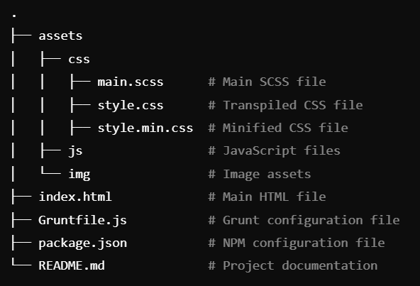

# Portfolio Website with SCSS and Grunt Automation

This is a personal portfolio website styled with SCSS and automated using Grunt. The project includes SCSS to CSS transpilation, CSS minification, and file watching for changes.

## Features
- **SCSS**: Modular and maintainable styling.
- **Grunt**: Used for automating the workflow:
  - SCSS compilation to CSS
  - CSS minification
  - File watching for automated updates on changes
- **Autoprefixer**: Automatically adds vendor prefixes for better cross-browser compatibility.

## Installation

### Prerequisites
Make sure you have the following installed:
- [Node.js](https://nodejs.org/) (for npm)
- [Grunt CLI](https://gruntjs.com/getting-started)

### Steps
1. **Clone the Repository**
   ```bash
   git clone https://github.com/yourusername/portfolio-website-scss.git
   cd portfolio-website-scss
2. **Install Dependencies**
   ```bash
   npm install
   ```
4. **Run Grunt Tasks** To compile SCSS to CSS, minify CSS, and start watching files
   ```
   grunt
   ```
6. **File Structure**


8. **Grunt Tasks**
- sass: Compiles SCSS to CSS.
- cssmin: Minifies the CSS files.
- watch: Watches for changes in SCSS files and automatically recompiles and minifies them.
9. **How to Use**
- Modify the SCSS files in the assets/css folder as needed.
- Run grunt to transpile SCSS to CSS and minify it.
- The resulting CSS files will be placed in the same directory (assets/css).
